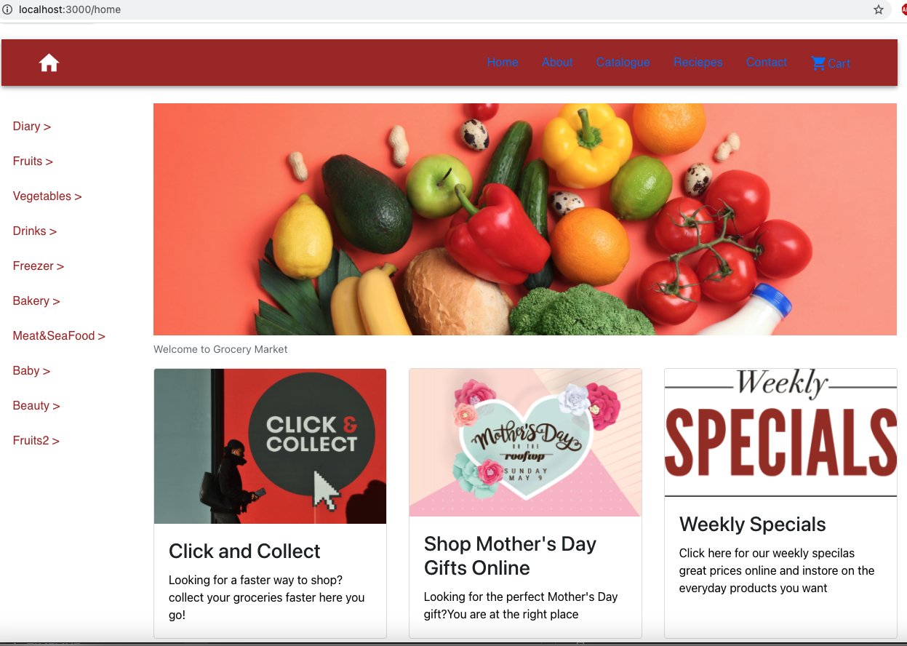

# GroceryMarket
### Technologies: React and MongoDB.
## Project Plan
 

 
## Project setup
Installation - clone this repo and open in VS code 

open terminal

cd client ......> npm install ......> npm start 

cd server ......> npm install ......> npm start 

## Project output
Automatically opens browser on http://localhost:3000/ Where u can see Grocery market page

The Grocery market page will be display on screen: 

1. To perform any CRUD functioning that means create,read,update and delete data.
Click on "AdminLogin" button displayed on top of the page. 

 * Admin routes are protected
   please use below credentials for admin sign in:
   
   "user name": vathsala

   "password": vathsaladmin

   

 * After succesfull login,this allows admin to do CRUD operations on categories and grocery items.
  

 *  "create" allows admin to create new category as well as new item
 

 *  "read" allows admin to read existing categories as well as items
 

 *  "update" allows admin to update categories as well as items
 
 (added category names are displayed on home page in the fixed side bar)
 
 *  "delete" allows admin to delete categories as well as items 
 

2. To shop items on grocery market 
  goto http://localhost:3000/home
 

 * When user clicks on the category name on the side bar it shows list of all items in that category next to it.

 * There is an option "Add to cart" next to each item, if user clicks on it, that item will be added to the cart.
   

 * When user clicks on "Cart" it shows all items added to the cart. With checkout button on bottom.

 *  Checkout looks like this

* 

